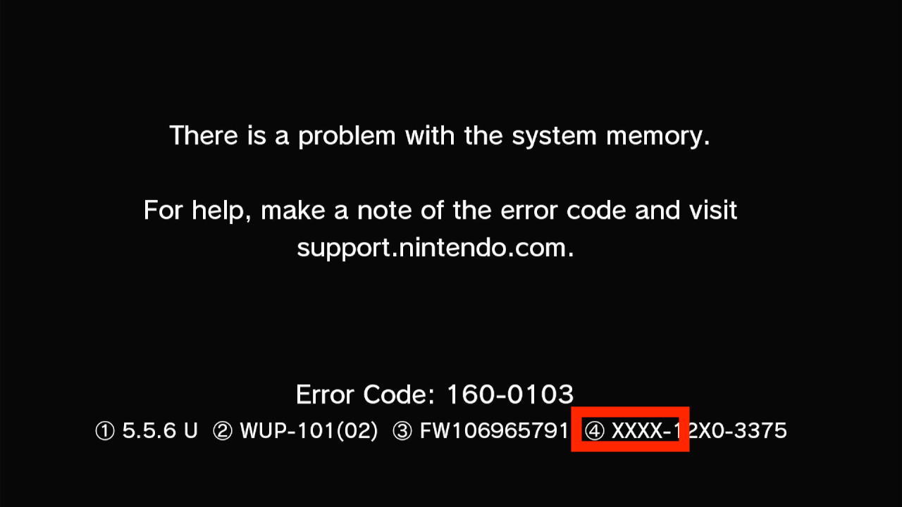

# "Problem with the System Memory" 160-0101 or 160-0103 Error

These are generic error codes on the Wii U and can represent one of several problems. To help differentiate, you should check the (4) box and see if the first 4 characters are all X's or numbers/letters.

Choose the option below, that matches your error screen:

#### [➡️ Begins with numbers/digits](cbhc-brick/index.md)
#### [➡️ Begins with XXXX- (like in the image)](misc.md)